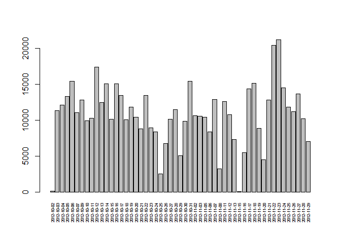
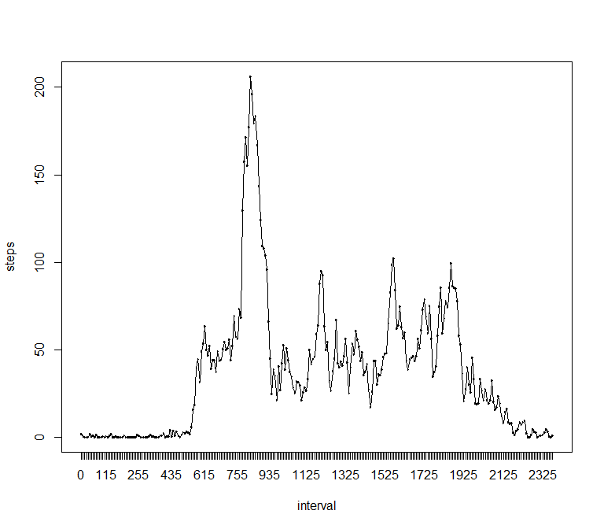
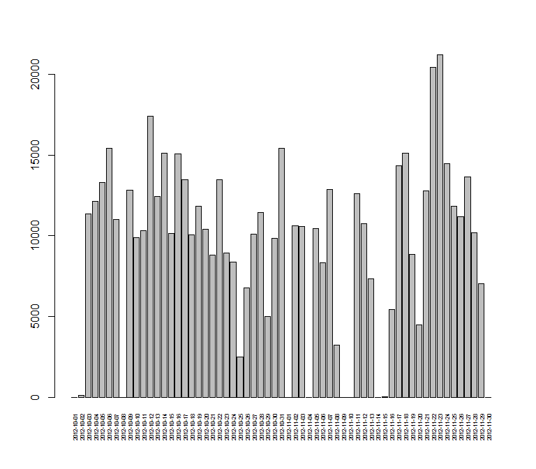
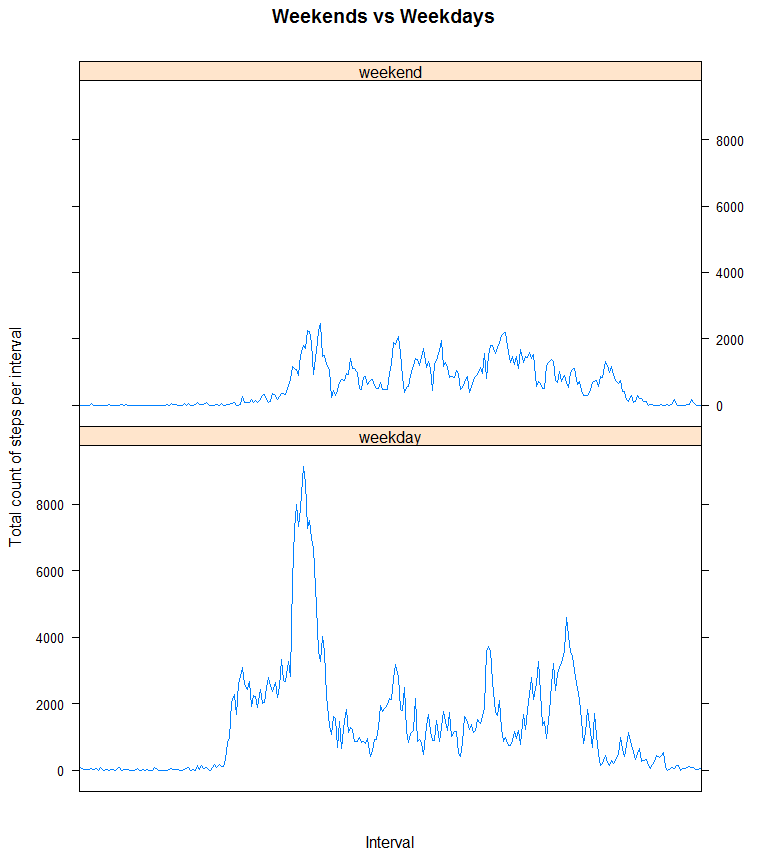

# Reproducible Research: Peer Assessment 1


## Loading and preprocessing the data
Here we load the file, save the original dataset and remove the rows containing NA lines. 


```r
m <- read.csv(unz("activity.zip", "activity.csv"), colClasses=c("numeric", "character", "numeric"), header=T)
m$date <- as.POSIXct(m$date)
m$interval <- as.factor(m$interval)
n <- m
m <- m[!is.na(m$steps),]
```


## What is mean total number of steps taken per day?
We aggregate the data and draw the plot.

```r
v <- aggregate(m$steps, by=list(date = m$date), FUN=sum)
v$x <- as.numeric(v$x)
barplot(v$x, names.arg = v$date, las=3, cex.names=0.5)
```



The median total number of steps per day is **10765**.
The median total number of steps per day is **10766.1886792453**.

## What is the average daily activity pattern?
Here we aggregate data by inteval and plot it

```r
z <- aggregate(m$steps, by=list(date = m$interval), FUN=mean)
names(z) <-c("interval", "steps")
with(z, 
plot (steps ~ interval))
lines(z$steps, type="l")
```



Finding the interval with maximal step number:

```r
maxsteps <- max(z$steps)
maxint <- z[z$steps == maxsteps,]
```
The interval with maximal step number is **835**.

## Imputing missing values

There are 2304 rows with missing values.

We insert the average per day values instead of missing ones with the help of zoo library.

```r
library(zoo)
```

```
## Warning: package 'zoo' was built under R version 3.2.3
```

```r
v <- n
v$steps <- na.aggregate(v$steps, by=list(v$date), FUN=mean, na.rm=F)
#just in case if data for the day is missing altogether
v$steps[is.nan(v$steps)] <- 0

b <- aggregate(v$steps, by=list(date = v$date), FUN=sum)
b$x <- as.numeric(b$x)
barplot(b$x, names.arg = b$date, las=3, cex.names=0.5)
```



The median total number of steps per day for imputted data is **10395**.
The mean total number of steps per day for imputted data is **9354.22950819672**.


## Are there differences in activity patterns between weekdays and weekends?
We separate weekends and weekdays.


```r
Sys.setlocale(category = "LC_ALL", locale = "english")
```

```
## [1] "LC_COLLATE=English_United States.1252;LC_CTYPE=English_United States.1252;LC_MONETARY=English_United States.1252;LC_NUMERIC=C;LC_TIME=English_United States.1252"
```

```r
w <- v
w$day <- weekdays(w$date)=="Sunday" | weekdays(w$date)=="Saturday"
w$day[w$day == T] <- "weekend"
w$day[w$day == F] <- "weekday"
w$day <- as.factor(w$day)
w<- aggregate(w$steps, by=list(interval = w$interval, day=w$day), FUN=sum)
 w$x <- as.numeric(w$x)
```

And plot the daily patterns

```r
library(lattice)
xyplot(x~interval | factor(day), data=w, pch=19, main="Weekends vs Weekdays", xlab="Interval",  ylab="Total count of steps per interval",layout=c(1,2),type="l", scales=list(x=list(at=seq(0, 2000, 400), labels=c('0', '4', '8', '12', '16', '20'))))
```



...and we can see the peak values weekday mornings and evenings -- probably, people going to work and leaving.
